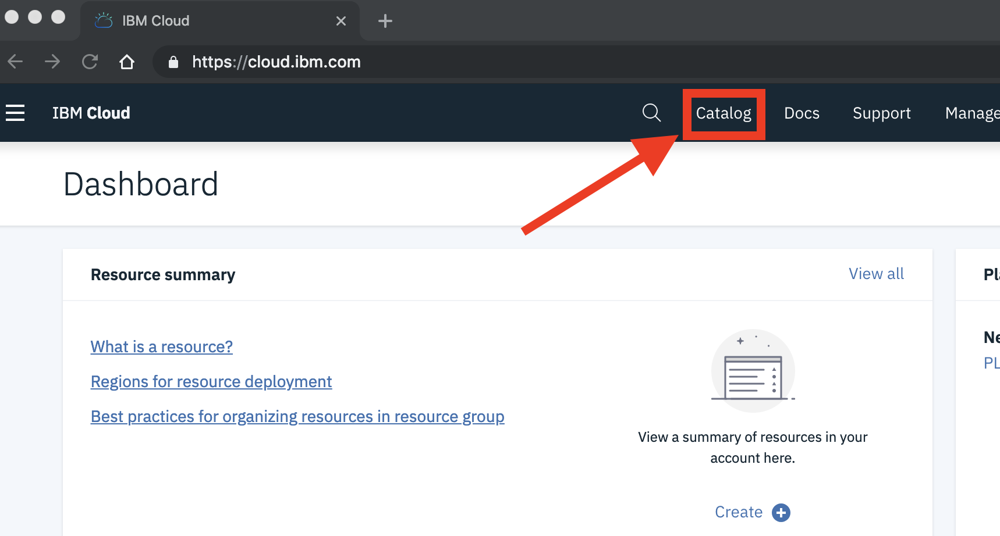
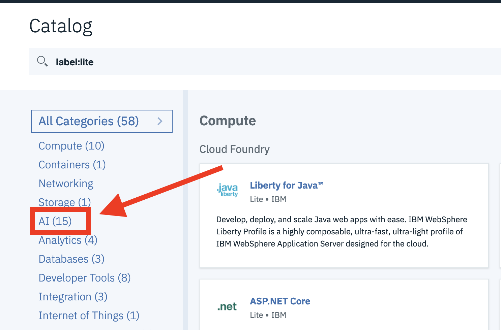
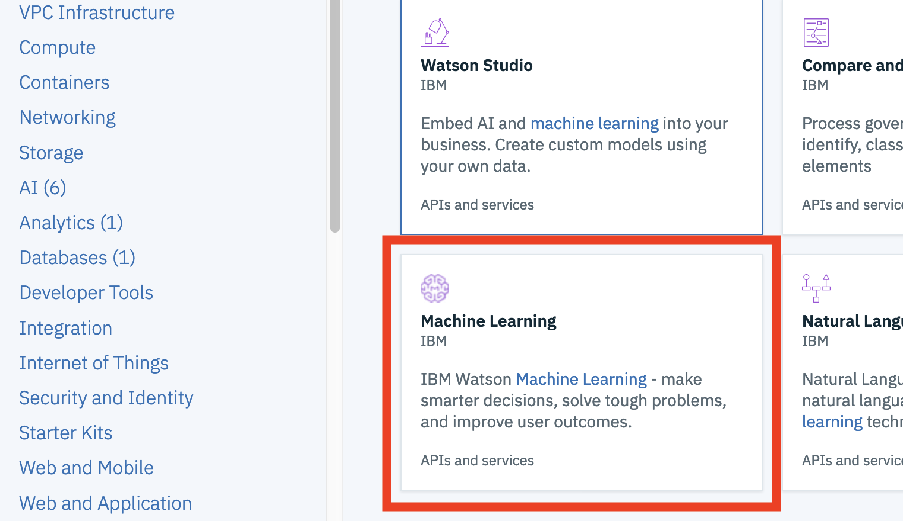
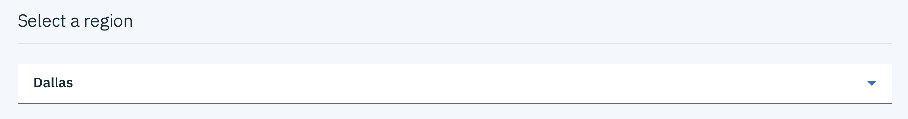
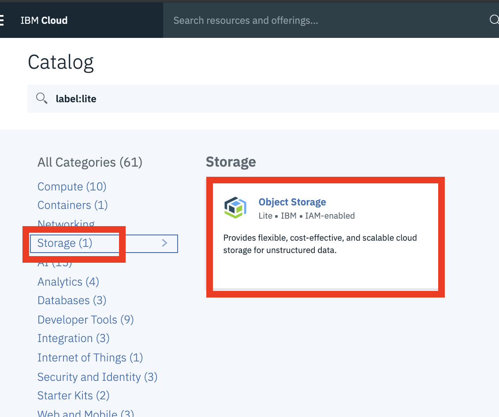
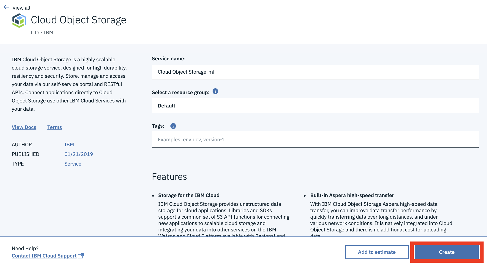
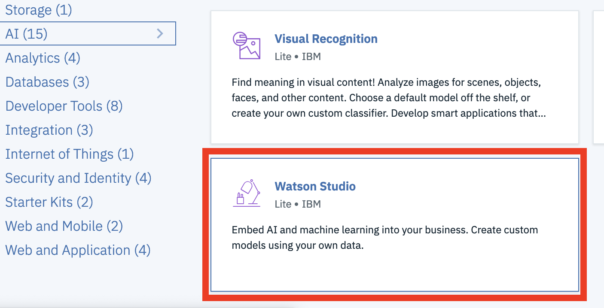
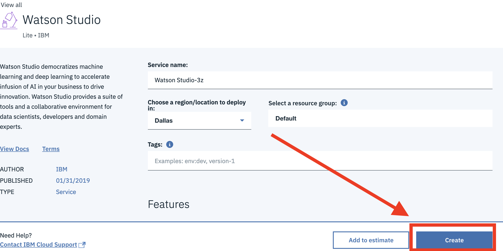
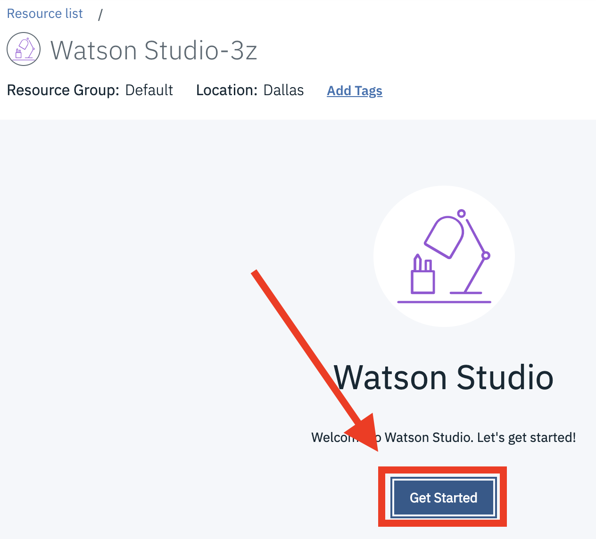

# Setup Before Exploring AI/ML/DL in IBM Cloud

## Prerequisites

- An IBM Cloud ID

## Applying a Promotional Code

If you login to IBM Cloud with a free IBM Cloud account, it's required to apply a promotion code to your account. The promotion code will be distributed during the session.  

1. login to [IBM Cloud](https://cloud.ibm.com)

2. Select `Manage` from the top menu bar, then `Account`.  

3. Within the `Account` page, select the `Account Settings` option.

4. Scroll down to locate `Subscription and feature codes` section.

5. Click `Apply code` and enter your promotion code.

    

## Setting Up Watson Machine Learning

Complete the following steps to set up a `Watson Machine Learning` instance.

1. Go to the [IBM Cloud console]((https://cloud.ibm.com)) - (https://cloud.ibm.com) and log in (or create an account if you do not have one).

1. Click on the **`Catalog`** link in the top banner of the IBM Cloud dashboard.  
   

1. Select the AI category on the left, under `All Categories`.  
   

1. Select the Machine Learning service tile.  
   

1. Set `Region` to `Dallas`.
   

    >> **Note:** **important** to select `Dallas` as the `Region`. At the time of this writing on 10/22/2019, certain AI/ML/DL features are only available in this region.

1. Select the `Lite` plan.

1. Change the instance name if you prefer.

1. Select `Default` as the `resource group`.

1. `Create`.

## Setting Up Object Storage

If you have created a `Object Storage` instance within your account, you skip this section.

Complete the following steps to set up your `Object Storage` environment.

1. Go to the [IBM Cloud console]((https://cloud.ibm.com)) - (https://cloud.ibm.com) and log in (or create an account if you do not have one).

1. Click on the **`Catalog`** link in the top banner of the IBM Cloud dashboard.  
   

1. Select the `Storage` category on the left, under `All Categories`. 
    
1. Select the `Object Storage` service tile.
   

1. Leave the default options, using the Lite plan and click the **`Create`** button.  
   

## Setting Up Watson Studio

If you have created a `Watson Studio` instance within your account, you skip this section.

Complete the following steps to set up the `Watson Studio` environment.

1. Go to the [IBM Cloud console]((https://cloud.ibm.com)) - (https://cloud.ibm.com) and log in (or create an account if you do not have one).

1. Click on the **`Catalog`** link in the top banner of the IBM Cloud dashboard.  
   

1. Select the AI category on the left, under `All Categories`.  
   

1. Select the `Watson Studio` service tile.  
   

1. Change `Region` to `Dallas`.
   

    >> **Note:** **important** to select `Dallas` as the `Region`. At the time of this writing on 10/22/2019, certain AI/ML/DL features are only available in this region.

1. Select the `Lite` plan.

1. Change the instance name if you prefer.

1. Select `Default` as the `resource group`.

1. `Create`.
   

1. Click on the **`Get Started`** button to open the Watson Studio tooling.  
   

